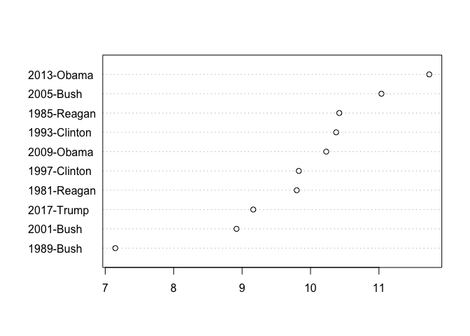
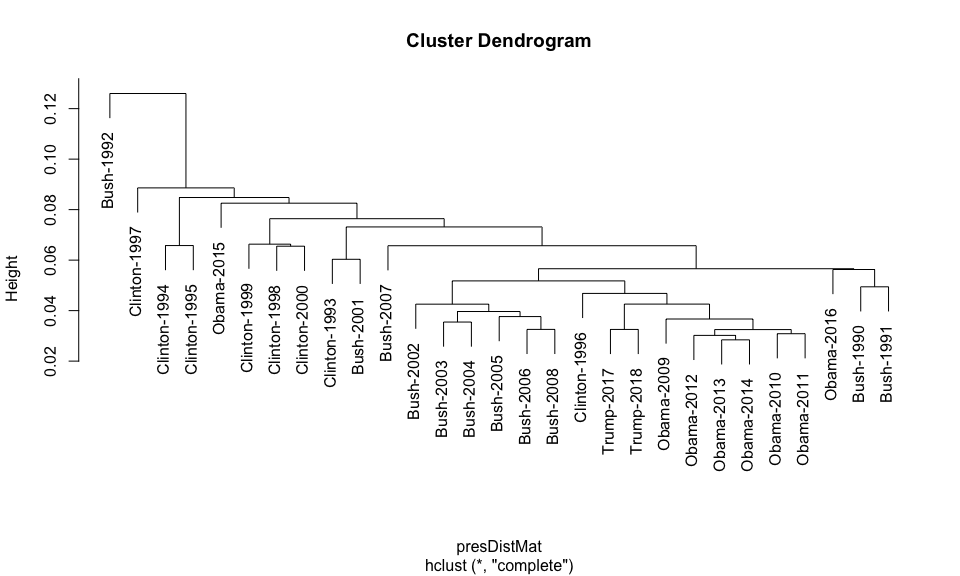

Descriptive Analysis of Texts
=============================

### Kenneth Benoit

### 24 April 2017

quateda has a number of descriptive statistics available for reporting
on texts. The **simplest of these** is through the `summary()` method:

``` r
require(quanteda)
## Loading required package: quanteda
## Package version: 1.1.4
## Parallel computing: 2 of 8 threads used.
## See https://quanteda.io for tutorials and examples.
## 
## Attaching package: 'quanteda'
## The following object is masked from 'package:utils':
## 
##     View
txt <- c(sent1 = "This is an example of the summary method for character objects.",
         sent2 = "The cat in the hat swung the bat.")
summary(txt)
##    Length     Class      Mode 
##         2 character character
```

This also works for corpus objects:

``` r
summary(corpus(data_char_ukimmig2010, notes = "Created as a demo."))
## Warning in corpus.character(data_char_ukimmig2010, notes = "Created as a
## demo."): Argument notes not used.
## Corpus consisting of 9 documents:
## 
##          Text Types Tokens Sentences
##           BNP  1125   3280        88
##     Coalition   142    260         4
##  Conservative   251    499        15
##        Greens   322    679        21
##        Labour   298    683        29
##        LibDem   251    483        14
##            PC    77    114         5
##           SNP    88    134         4
##          UKIP   346    723        27
## 
## Source: /Users/kbenoit/GitHub/ITAUR/5_descriptive/* on x86_64 by kbenoit
## Created: Wed Mar 28 15:42:42 2018
## Notes:
```

To access the **syllables** of a text, we use `syllables()`:

``` r
nsyllable(c("Superman.", "supercalifragilisticexpialidocious", "The cat in the hat."))
## [1]  3 13  5
```

We can even compute the **Scabble value** of English words, using
`scrabble()`:

``` r
nscrabble(c("cat", "quixotry", "zoo"))
## [1]  5 27 12
```

We can analyze the **lexical diversity** of texts, using `lexdiv()` on a
dfm:

``` r
myDfm <- dfm(corpus_subset(data_corpus_inaugural, Year > 1980))
lexstat <- textstat_lexdiv(myDfm, "R")
lexstat <- lexstat[order(lexstat[["R"]]), ]
with(lexstat, dotchart(R, labels = document))
```


We can analyze the **readability** of texts, using `readability()` on a
vector of texts or a corpus:

``` r
readab <- textstat_readability(corpus_subset(data_corpus_inaugural, Year > 1980), 
                               measure = "Flesch.Kincaid")
readab <- readab[order(readab[["Flesch.Kincaid"]]), ]
with(readab, dotchart(Flesch.Kincaid, labels = document))
```



We can **identify documents and terms that are similar to one another**,
using `similarity()`:

``` r
## Presidential Inaugural Address Corpus
presDfm <- corpus_subset(data_corpus_inaugural, Year > 1980) %>%
    dfm(remove = stopwords("english"), remove_punct = TRUE)
# compute some document similarities
textstat_simil(presDfm, "1985-Reagan")
##              1985-Reagan
## 1981-Reagan    0.6489211
## 1985-Reagan    1.0000000
## 1989-Bush      0.5028420
## 1993-Clinton   0.5549002
## 1997-Clinton   0.6064454
## 2001-Bush      0.4371266
## 2005-Bush      0.4553173
## 2009-Obama     0.5329123
## 2013-Obama     0.5878448
## 2017-Trump     0.4208903
textstat_simil(presDfm, c("2009-Obama", "2013-Obama"), method = "cosine")
##              2009-Obama 2013-Obama
## 1981-Reagan   0.5768486  0.6054181
## 1985-Reagan   0.5892557  0.6331729
## 1989-Bush     0.5721535  0.5290330
## 1993-Clinton  0.5925820  0.5997993
## 1997-Clinton  0.6297973  0.6121809
## 2001-Bush     0.5411649  0.5561972
## 2005-Bush     0.4575297  0.5163644
## 2009-Obama    1.0000000  0.6373318
## 2013-Obama    0.6373318  1.0000000
## 2017-Trump    0.4481950  0.4546945
textstat_dist(presDfm, c("2009-Obama", "2013-Obama"), method = "canberra")
##              2009-Obama 2013-Obama
## 1981-Reagan    2710.790   2710.900
## 1985-Reagan    2688.975   2695.884
## 1989-Bush      2719.360   2722.737
## 1993-Clinton   2663.017   2642.759
## 1997-Clinton   2657.669   2619.519
## 2001-Bush      2688.230   2602.257
## 2005-Bush      2664.505   2629.855
## 2009-Obama        0.000   2595.474
## 2013-Obama     2595.474      0.000
## 2017-Trump     2733.536   2713.055
textstat_dist(presDfm, c("2009-Obama", "2013-Obama"), method = "ejaccard")
##              2009-Obama 2013-Obama
## 1981-Reagan   0.4045958  0.4323920
## 1985-Reagan   0.4043241  0.4445237
## 1989-Bush     0.4002481  0.3586377
## 1993-Clinton  0.4198420  0.4278869
## 1997-Clinton  0.4377781  0.4166254
## 2001-Bush     0.3569588  0.3732546
## 2005-Bush     0.2961977  0.3468687
## 2009-Obama    1.0000000  0.4675145
## 2013-Obama    0.4675145  1.0000000
## 2017-Trump    0.2805344  0.2875123

# compute some term similarities
lapply(as.list(textstat_simil(presDfm, c("fair", "health", "terror"), margin = "features", method = "cosine")), 
       head, n = 10)
## $fair
##      size  economic       tax beginning  national   economy  republic 
## 0.9045340 0.8922269 0.8869686 0.8864053 0.8775269 0.8775269 0.8703883 
##    months       god    create 
## 0.8703883 0.8703883 0.8616404 
## 
## $health
##       wrong      reform      common   knowledge      planet generations 
##   0.8944272   0.8944272   0.8888889   0.8888889   0.8819171   0.8728716 
##      ideals        true     without        long 
##   0.8540168   0.8432740   0.8432740   0.8399211 
## 
## $terror
##        full     sustain       solve        land commonplace      denied 
##   0.9428090   0.9128709   0.9128709   0.8876254   0.8660254   0.8660254 
##   guarantee     problem      racial      bounty 
##   0.8660254   0.8660254   0.8660254   0.8660254
```

And this can be used for **clustering documents**:

``` r
data(data_corpus_sotu, package = "quanteda.corpora")
presDfm <- dfm(corpus_subset(data_corpus_sotu, Date > "1990-01-01"), stem = TRUE,
               remove = c(stopwords("english"), "applause"), remove_punct = TRUE)
presDfm <- dfm_trim(presDfm, min_termfreq = 5, min_docfreq = 3)
# hierarchical clustering - get distances on normalized dfm
presDistMat <- dist(as.matrix(dfm_weight(presDfm, "relFreq")))
## Warning: scheme = "relfreq" is deprecated; use dfm_weight(x, scheme =
## "prop") instead
# hiarchical clustering the distance object
presCluster <- hclust(presDistMat)
# label with document names
presCluster$labels <- docnames(presDfm)
# plot as a dendrogram
plot(presCluster)
```



Or we could look at **term clustering** instead:

``` r
# word dendrogram with tf-idf weighting
wordDfm <- dfm_sort(dfm_tfidf(presDfm))
wordDfm <- t(wordDfm)[1:100,]  # because transposed
wordDistMat <- dist(wordDfm)
wordCluster <- hclust(wordDistMat)
plot(wordCluster, xlab="", main="tf-idf Frequency weighting")
```


Finally, there are number of helper functions to extract information
from quanteda objects:

``` r
myCorpus <- corpus_subset(data_corpus_inaugural, Year > 1980)

# return the number of documents
ndoc(myCorpus)           
```

    ## [1] 10

``` r
ndoc(dfm(myCorpus))
```

    ## [1] 10

``` r
# how many tokens (total words)
ntoken(myCorpus)
```

    ##  1981-Reagan  1985-Reagan    1989-Bush 1993-Clinton 1997-Clinton 
    ##         2790         2921         2681         1833         2449 
    ##    2001-Bush    2005-Bush   2009-Obama   2013-Obama   2017-Trump 
    ##         1808         2319         2711         2317         1660

``` r
ntoken("How many words in this sentence?")
```

    ## text1 
    ##     7

``` r
# arguments to tokenize can be passed 
ntoken("How many words in this sentence?", remove_punct = TRUE)
```

    ## text1 
    ##     6

``` r
# how many types (unique words)
ntype(myCorpus)
```

    ##  1981-Reagan  1985-Reagan    1989-Bush 1993-Clinton 1997-Clinton 
    ##          902          925          795          642          773 
    ##    2001-Bush    2005-Bush   2009-Obama   2013-Obama   2017-Trump 
    ##          621          773          938          814          582

``` r
ntype("Yada yada yada.  (TADA.)")
```

    ## text1 
    ##     6

``` r
ntype("Yada yada yada.  (TADA.)", remove_punct = TRUE)
```

    ## text1 
    ##     3

``` r
ntype(char_tolower("Yada yada yada.  (TADA.)"), remove_punct = TRUE)
```

    ## text1 
    ##     2

``` r
# can count documents and features
ndoc(data_corpus_inaugural)
```

    ## [1] 58

``` r
myDfm1 <- dfm(data_corpus_inaugural)
ndoc(myDfm1)
```

    ## [1] 58

``` r
nfeature(myDfm1)
```

    ## Warning: 'nfeature' is deprecated.
    ## Use 'nfeat' instead.
    ## See help("Deprecated")

    ## [1] 9357

``` r
myDfm2 <- dfm(data_corpus_inaugural, remove = stopwords("english"), stem = TRUE)
nfeature(myDfm2)
```

    ## Warning: 'nfeature' is deprecated.
    ## Use 'nfeat' instead.
    ## See help("Deprecated")

    ## [1] 5421

``` r
myDfm3 <- dfm(data_corpus_inaugural, remove = stopwords("english"), remove_punct = TRUE, stem = TRUE)
nfeature(myDfm3)
```

    ## Warning: 'nfeature' is deprecated.
    ## Use 'nfeat' instead.
    ## See help("Deprecated")

    ## [1] 5405

``` r
# can extract feature labels and document names
head(featnames(myDfm1), 20)
```

    ##  [1] "fellow-citizens" "of"              "the"            
    ##  [4] "senate"          "and"             "house"          
    ##  [7] "representatives" ":"               "among"          
    ## [10] "vicissitudes"    "incident"        "to"             
    ## [13] "life"            "no"              "event"          
    ## [16] "could"           "have"            "filled"         
    ## [19] "me"              "with"

``` r
head(docnames(myDfm1))
```

    ## [1] "1789-Washington" "1793-Washington" "1797-Adams"      "1801-Jefferson" 
    ## [5] "1805-Jefferson"  "1809-Madison"

``` r
# and topfeatures
topfeatures(myDfm1)
```

    ##   the    of     ,   and     .    to    in     a   our  that 
    ## 10082  7103  7026  5310  4945  4526  2785  2246  2181  1789

``` r
topfeatures(myDfm2) # without stopwords
```

    ##      ,      .      - nation govern  peopl      ;     us    can  state 
    ##   7026   4945    762    675    657    623    565    478    471    450

``` r
topfeatures(myDfm3) # without stopwords or punctuation
```

    ## nation govern  peopl     us    can  state  great   upon  power   must 
    ##    675    657    623    478    471    450    373    371    370    366
